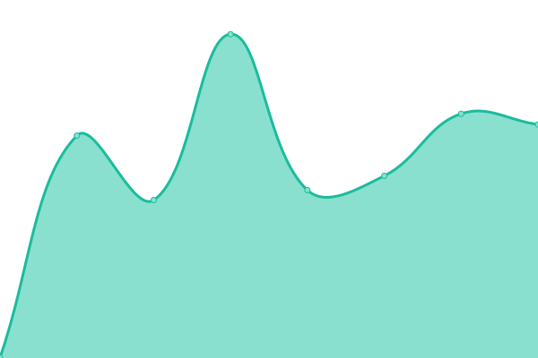
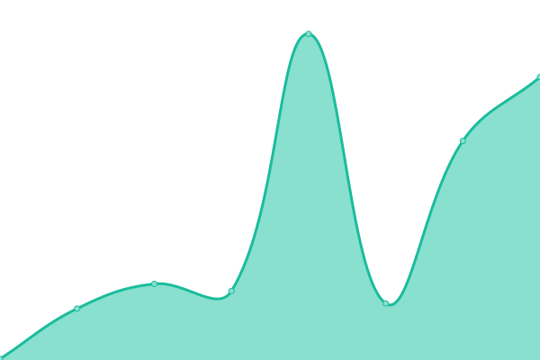

# [📈 Live Status](https://status.galt.me): <!--live status--> **🟩 All systems operational**

This repository contains the open-source uptime monitor and status page for [Adam Galt](https://galt.me), powered by [Upptime](https://github.com/upptime/upptime).

With [Upptime](https://upptime.js.org), you can get your own unlimited and free uptime monitor and status page, powered entirely by a GitHub repository. We use [Issues](https://github.com/AdamGalt/uptime/issues) as incident reports, [Actions](https://github.com/AdamGalt/uptime/actions) as uptime monitors, and [Pages](https://status.galt.me) for the status page.

<!--start: status pages-->
<!-- This summary is generated by Upptime (https://github.com/upptime/upptime) -->
<!-- Do not edit this manually, your changes will be overwritten -->
<!-- prettier-ignore -->
| URL | Status | History | Response Time | Uptime |
| --- | ------ | ------- | ------------- | ------ |
|  [galt.me](https://galt.me) | 🟩 Up | [galt-me.yml](https://github.com/AdamGalt/uptime/commits/HEAD/history/galt-me.yml) | 

 530ms
     
 | 

<a href="https://status.galt.me/history/galt-me">100.00%</a>
    

|  [blog.galt.me](https://blog.galt.me) | 🟩 Up | [blog-galt-me.yml](https://github.com/AdamGalt/uptime/commits/HEAD/history/blog-galt-me.yml) | 

 545ms
     
 | 

<a href="https://status.galt.me/history/blog-galt-me">100.00%</a>
    

|  [tv.galt.me](https://tv.galt.me) | 🟩 Up | [tv-galt-me.yml](https://github.com/AdamGalt/uptime/commits/HEAD/history/tv-galt-me.yml) | 

 540ms
     
 | 

<a href="https://status.galt.me/history/tv-galt-me">100.00%</a>
    

|  [music.galt.me](https://music.galt.me) | 🟩 Up | [music-galt-me.yml](https://github.com/AdamGalt/uptime/commits/HEAD/history/music-galt-me.yml) | 

 537ms
     
 | 

<a href="https://status.galt.me/history/music-galt-me">100.00%</a>
    

|  [screen.galt.me](https://screen.galt.me) | 🟩 Up | [screen-galt-me.yml](https://github.com/AdamGalt/uptime/commits/HEAD/history/screen-galt-me.yml) | 

 406ms
     
 | 

<a href="https://status.galt.me/history/screen-galt-me">100.00%</a>
    

|  [text.galt.me](https://text.galt.me) | 🟩 Up | [text-galt-me.yml](https://github.com/AdamGalt/uptime/commits/HEAD/history/text-galt-me.yml) | 

 530ms
     
 | 

<a href="https://status.galt.me/history/text-galt-me">100.00%</a>
    

|  [code.galt.me](https://code.galt.me) | 🟩 Up | [code-galt-me.yml](https://github.com/AdamGalt/uptime/commits/HEAD/history/code-galt-me.yml) | 

 529ms
     
 | 

<a href="https://status.galt.me/history/code-galt-me">100.00%</a>
    

|  [Google](https://www.google.com) | 🟩 Up | [google.yml](https://github.com/AdamGalt/uptime/commits/HEAD/history/google.yml) | 

 66ms
     
 | 

<a href="https://status.galt.me/history/google">100.00%</a>
    

<!--end: status pages-->

[**Visit our status website →**](https://status.galt.me)

## 📄 License

- Powered by: [Upptime](https://github.com/upptime/upptime)
- Code: [MIT](./LICENSE) © [Adam Galt](https://galt.me)
- Data in the `./history` directory: [Open Database License](https://opendatacommons.org/licenses/odbl/1-0/)
